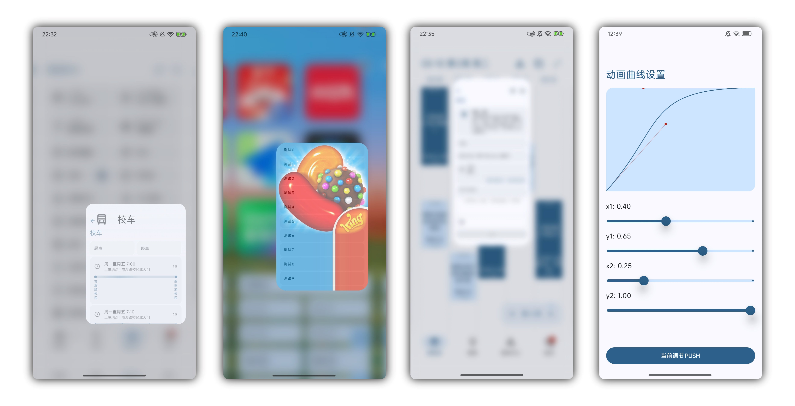

# SharedNav  [](https://jitpack.io/#Chiu-xaH/SharedNav)
容器共享与导航库，实现类似 Launcher 的打开关闭动画，支持背景压暗、镜面缩放、模糊，1像素填充、自适应贝赛尔曲线、屏幕圆角插值、内容一次渲染等特性；旨在减少开发流程、提高可定制性。



## [开发文档](docs/Developer.md)

## [Demo App](https://github.com/Chiu-xaH/SharedNav/releases/download/1.0.0-dev01/app-release.apk)

## 快速开始

**⚠️ 本库目前仍处于Dev开发阶段，目前已在[聚在工大](https://github.com/Chiu-xaH/HFUT-Schdule)项目中实际使用，其余项目推荐等正式版发布后再接入本库**

### 引入依赖

在settings.gradle添加

Groovy使用
```Groovy
maven { 
    url 'https://jitpack.io'
}
```
Kotlin使用
```Kotlin
maven {
    url = uri("https://jitpack.io")
}
```
添加依赖，版本以 Release 的 Tag 为准
```Groovy
implementation("com.github.Chiu-xaH:SharedNav:<version>")
```

---

### 创建第一个 Destination

每个页面对应一个 `Destination` 对象，继承抽象类并实现 `key` 与 `Content()`：

```kotlin
object HomeDestination : Destination() {
    override val key = "home"   // 全局唯一，同时用作容器共享的匹配 Key

    @Composable
    override fun Content() {
        HomeScreen()
    }
}
```

---

### 初始化导航宿主

在 Activity 或顶层 Composable 中启动导航：

**写法 1：**

```kotlin
@Composable
fun App() {
    SharedNavHost(
        startDestination = HomeDestination
    )
}
```

**写法 2：手动控制 NavController**

```kotlin
val navController = rememberNavController(startDestination = HomeDestination)

SharedNavHost(
    navController = navController,
)
```

---

### 页面跳转与返回

在任意 Composable 中通过 `LocalNavController` 或 `LocalNavControllerSafely` 获取控制器：

> **提示**：如果无法保证 Composable 函数一定在 `SharedNav` 下调用，请使用 `LocalNavControllerSafely`，它返回可空对象；`LocalNavController` 获取不到控制器时会直接抛出异常导致 Crash。

```kotlin
@Composable
fun HomeScreen() {
    val navController = LocalNavController.current

    Button(onClick = { navController.push(DetailDestination) }) {
        Text("进入详情")
    }

    Button(onClick = { navController.pop() }) {
        Text("返回")
    }
}
```

---

### 添加容器共享动效

用 `SharedContainer` 包裹触发跳转的组件，`key` 与目标 `Destination.key` 保持一致，即可获得类 Launcher 的展开/收起动画。

**写法 1：**

```kotlin
@Composable
fun HomeScreen() {
    val navController = LocalNavController.current
    val dest = DetailDestination

    SharedContainer(
        key = dest.key,
        shape = MaterialTheme.shapes.medium,
    ) {
        Card(
            shape = RectangleShape,
            onClick = { navController.push(dest) }
        ) { /* 内容 */ }
    }
}
```

**写法 2：Modifier 扩展**

```kotlin
@Composable
fun HomeScreen() {
    val navController = LocalNavController.current
    val dest = DetailDestination

    Card(
        modifier = Modifier.sharedContainer(
            key = dest.key,
            shape = MaterialTheme.shapes.medium
        ),
        shape = RectangleShape,
        onClick = { navController.push(dest) }
    ) { /* 内容 */ }
}
```

> **注意**：`SharedContainer` 内层组件的 `shape` 必须设置为无圆角，圆角统一由外层 `SharedContainer` 管理，否则在提取 1 像素时会缺失边角。

## 编译为 Release aar
```bash
./gradlew assembleRelease
```

## 后续计划
1. SDK32及其以下背景缩放启用时，动画结束瞬间容器稍微位移抽搐的Bug      [P0]
2. 并行动画     [P1]
3. 大屏适配（平行视界）         [P1]
4. spring回弹时最后顿挫的问题    [P1]
5. 预测式返回     [P2]
6. deeplink         [P4]
7. 元素共享及导航适配     [P4]
8. Kotlin Multiplatform         [P4]
