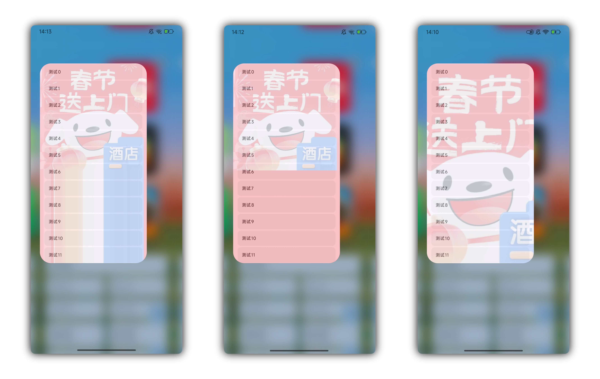
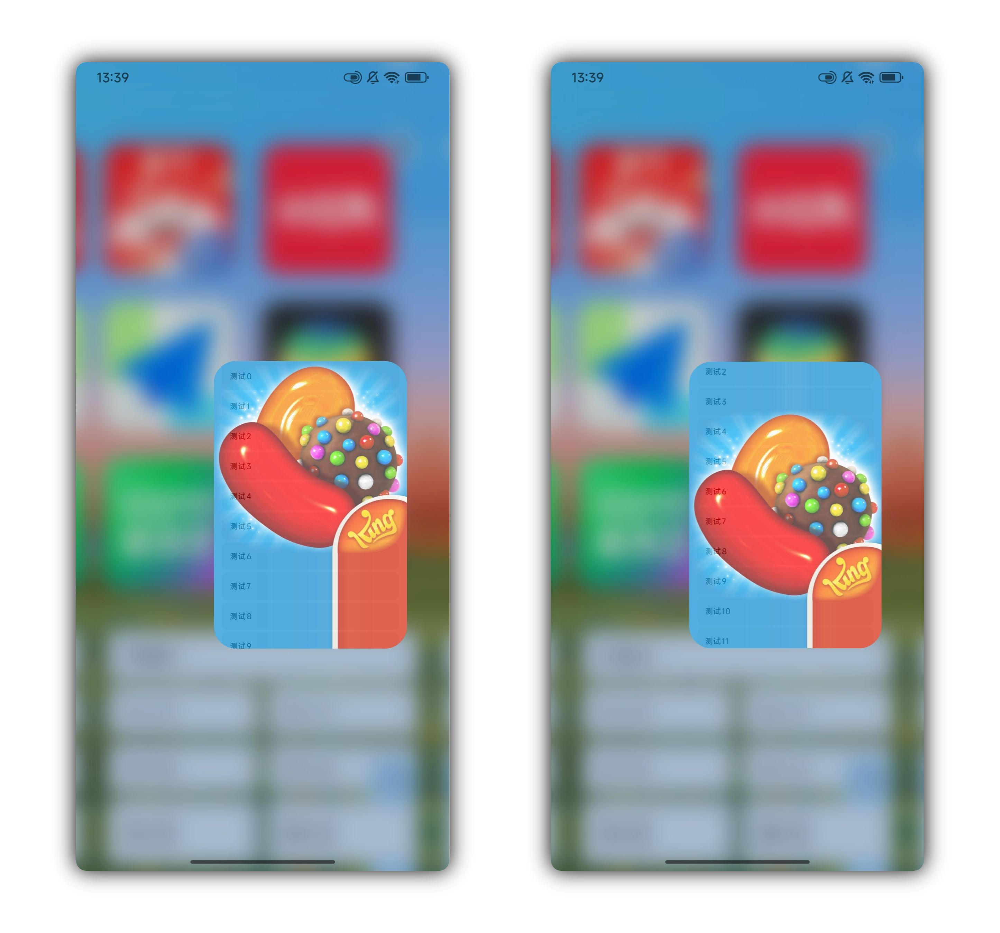
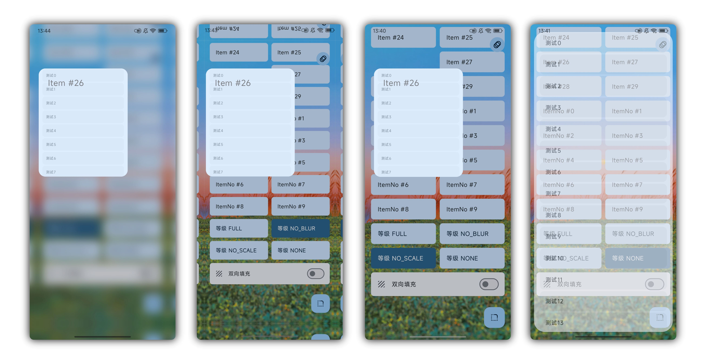
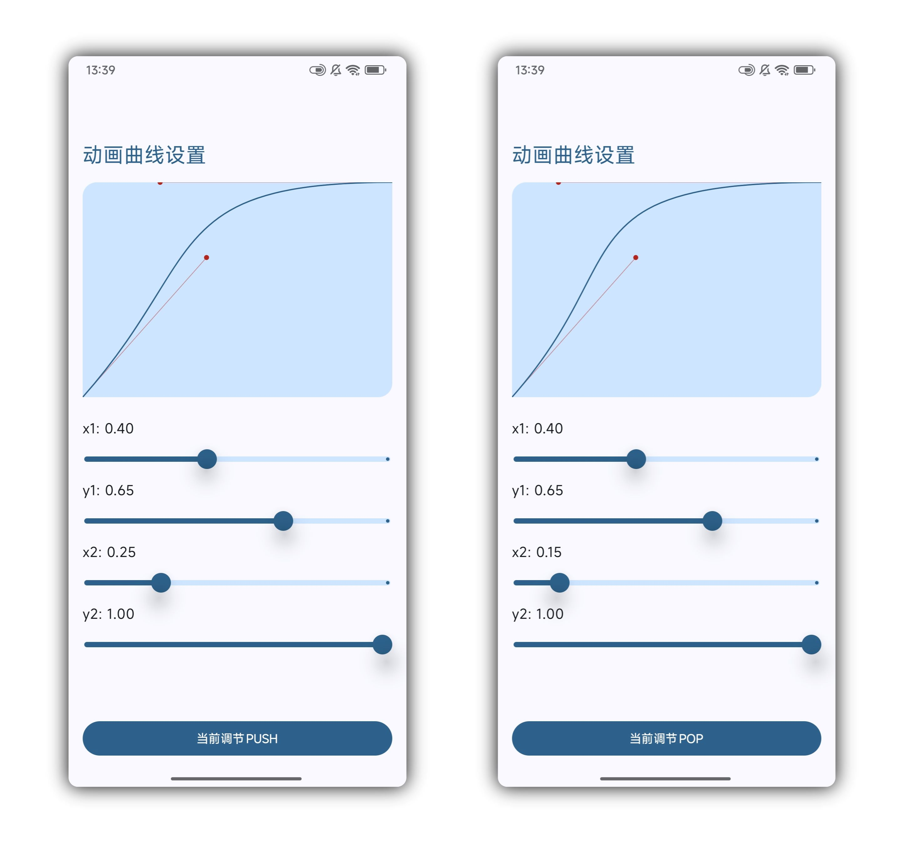
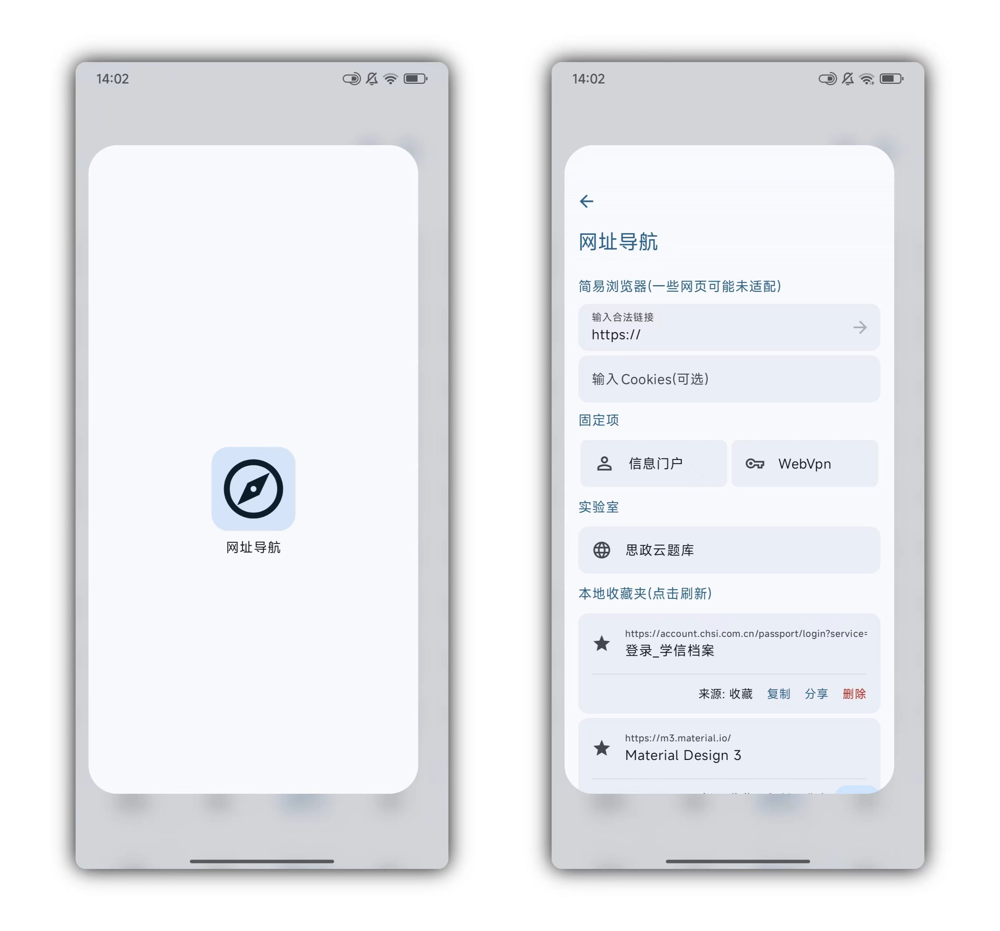

# 开发文档（By Claude）

> 容器共享 & 导航动效库 —— 类 Launcher 的打开/关闭动画，支持背景压暗、镜面缩放、背景模糊、容器 1 像素填充、自适应贝塞尔曲线、屏幕圆角插值等特性。

---

## 1. 快速开始

### 1.1 引入依赖

在settings.gradle添加
Groovy使用
```Groovy
maven { 
    url 'https://jitpack.io'
}
```
Kotlin使用
```Kotlin
maven {
    url = uri("https://jitpack.io")
}
```
添加依赖，版本以 Release 的 Tag 为准
```Groovy
implementation("com.github.Chiu-xaH:SharedNav:<version>")
```

---

### 1.2 创建第一个 Destination

每个页面对应一个 `Destination` 对象，继承抽象类并实现 `key` 与 `Content()`：

```kotlin
object HomeDestination : Destination() {
    override val key = "home"   // 全局唯一，同时用作容器共享的匹配 Key

    @Composable
    override fun Content() {
        HomeScreen()
    }
}
```

---

### 1.3 初始化导航宿主

在 Activity 或顶层 Composable 中启动导航：

**写法 1：**

```kotlin
@Composable
fun App() {
    SharedNavHost(
        startDestination = HomeDestination
    )
}
```

**写法 2：手动控制 NavController**

```kotlin
val navController = rememberNavController(startDestination = HomeDestination)

SharedNavHost(
    navController = navController,
)
```

---

### 1.4 页面跳转与返回

在任意 Composable 中通过 `LocalNavController` 或 `LocalNavControllerSafely` 获取控制器：

> **提示**：如果无法保证 Composable 函数一定在 `SharedNav` 下调用，请使用 `LocalNavControllerSafely`，它返回可空对象；`LocalNavController` 获取不到控制器时会直接抛出异常导致 Crash。

```kotlin
@Composable
fun HomeScreen() {
    val navController = LocalNavController.current

    Button(onClick = { navController.push(DetailDestination) }) {
        Text("进入详情")
    }

    Button(onClick = { navController.pop() }) {
        Text("返回")
    }
}
```

---

### 1.5 添加容器共享动效

用 `SharedContainer` 包裹触发跳转的组件，`key` 与目标 `Destination.key` 保持一致，即可获得类 Launcher 的展开/收起动画。

**写法 1：**

```kotlin
@Composable
fun HomeScreen() {
    val navController = LocalNavController.current
    val dest = DetailDestination

    SharedContainer(
        key = dest.key,
        shape = MaterialTheme.shapes.medium,
    ) {
        // 内层组件 shape 必须为 RoundedCornerShape(0.dp) 或 RectangleShape
        Card(
            shape = RectangleShape,
            onClick = { navController.push(dest) }
        ) { /* 内容 */ }
    }
}
```

**写法 2：Modifier 扩展**

```kotlin
@Composable
fun HomeScreen() {
    val navController = LocalNavController.current
    val dest = DetailDestination

    Card(
        modifier = Modifier.sharedContainer(
            key = dest.key,
            shape = MaterialTheme.shapes.medium
        ),
        shape = RectangleShape,
        onClick = { navController.push(dest) }
    ) { /* 内容 */ }
}
```

> **注意**：`SharedContainer` 内层组件的 `shape` 必须设置为无圆角，圆角统一由外层 `SharedContainer` 管理，否则在提取 1 像素时会缺失边角。

`SharedContainer` 除必填的 `key` 和 `shape` 外，还有以下可选参数：

| 参数 | 类型 | 默认值 | 说明 |
|---|---|---|---|
| `shadow` | `Dp` | `0.dp` | 阴影 |
| `containerColor` | `Color?` | `null` | `null` 时：SDK 33+ 使用像素提取填充，低版本使用裁切填充；指定颜色时：SDK 33+ 使用像素提取填充，低版本使用颜色填充 |
| `containerFilledStrategy` | `ContainerFilledStrategy` | `Pixel()` | 更精细地指定填充方式，与 `containerColor` 二选一，不同时使用 |

---

## 2. 核心概念

### 2.1 模块结构

| 模块 | 职责 |
|---|---|
| `navigation` | 页面路由、返回栈管理、导航过渡动画（背景压暗 / 缩放 / 模糊） |
| `shared-container` | 容器共享动效核心：记录源/目标矩形，驱动跨页过渡动画 |
| `common` | `ScreenCornerHelper`（读取屏幕圆角）、线性插值工具等 |
| `app` | 示例应用，演示基础功能 |

### 2.2 数据流概览

```
用户调用 navController.push(destination)
  → NavigationController 操作返回栈
  → 触发 NavTransition 状态变更
  → NavHost 响应变更，播放页面过渡动画
      ├── BackgroundEffect（背景页：压暗 / 缩放 / 模糊）
      └── ForegroundEffect（前景页：缩放 / 圆角插值 / 模糊）

若存在 SharedContainer：
  SharedRegistry 驱动容器动画
  → 动画完成后通知 NavHost 同步结束
```

---

## 3. 导航 API — `navigation` 模块

### 3.1 `Destination`

所有页面的基类，开发者继承后实现以下成员：

| 成员 | 类型 | 默认值 | 说明 |
|---|---|---|---|
| `key` | `String` | 必填 | 全局唯一，同时作为容器共享的匹配 Key |
| `Content()` | `@Composable` | 必填 | 页面 UI 内容 |
| `PlaceHolder` | `(@Composable () -> Unit)?` | `null` | 启动屏内容，动画期间先显示，结束后切换为真实内容 |
| `enforcePlaceHolder` | `Boolean` | `false` | 强制在动画期间显示 PlaceHolder，不依赖全局 `enableSplashScreen` 开关 |

**带参数的 Destination（推荐用 `data class`）：**

```kotlin
data class SecondDestination(val userId: Int) : Destination() {
    override val key = "second_$userId"

    @Composable
    override fun Content() { SecondScreen() }
}

// 使用
navController.push(SecondDestination(userId = 42))
```

---

### 3.2 `rememberNavController`

创建并记住一个 `NavigationController` 实例：

```kotlin
val navController = rememberNavController(startDestination = HomeDestination)
```

---

### 3.3 `SharedNavHost` / `NavHost`

| 参数 | 类型 | 默认值 | 说明 |
|---|---|---|---|
| `startDestination` | `Destination` | 必填 | 初始页面 |
| `navController` | `NavigationController` | 内部自动创建 | 传入已有实例以手动控制 |
| `modifier` | `Modifier` | `Modifier` | 应用到宿主容器 |
| `dependencies` | `Dependencies` | `Dependencies()` | 跨页面注入的依赖数据 |
| `customBackHandler` | `@Composable () -> Unit` | `DefaultBackHandler()` | 自定义返回手势/按键处理 |

`SharedNavHost` 在内部自动包裹 `SharedContainerRoot`，启用容器共享功能。不需要容器共享时可直接使用 `NavHost`。

---

### 3.4 `NavigationController`

#### 核心方法

```kotlin
// 跳转到目标页面
fun push(destination: Destination, launchMode: LaunchMode = LaunchMode.Push(reuse = true))

// 返回上一页
fun pop()

// 获取当前栈顶
fun current(): StackEntry?

// 是否可以返回
fun canPop(): Boolean
```

#### 常用属性

| 属性 | 类型 | 默认值 | 说明 |
|---|---|---|---|
| `transitionLevel` | `EffectLevel` | `FULL` | 全局动效等级，可运行时动态切换 |
| `enableSplashScreen` | `Boolean` | `false` | 动画期间是否对前景页显示 PlaceHolder |
| `isTransitioning` | `Boolean` | `false`（只读） | 当前是否正在播放过渡动画 |
| `stack` | `List<StackEntry>` | 只读 | 当前导航返回栈 |

---

## 4. 容器共享 API — `shared-container` 模块

### 4.1 `SharedContainer`（Composable 写法）

包裹触发跳转的卡片/按钮，作为容器共享的「源端」。

| 参数 | 类型 | 默认值 | 说明 |
|---|---|---|---|
| `key` | `Any` | 必填 | 与目标 `Destination.key` 完全一致 |
| `shape` | `Shape` | 必填 | 容器圆角形状，过渡时会对此圆角做插值 |
| `containerColor` | `Color?` | `null` | 容器背景色；`null` 时自动使用 1 像素填充策略 |
| `containerFilledStrategy` | `ContainerFilledStrategy` | `Pixel()` | 容器填充策略，详见 4.3 节，与 `containerColor` 二选一 |
| `shadow` | `Dp` | `0.dp` | 容器阴影 |
| `modifier` | `Modifier` | `Modifier` | 外层修饰符 |

```kotlin
SharedContainer(
    key = dest.key,
    shape = RoundedCornerShape(20.dp),
    containerColor = MaterialTheme.colorScheme.primaryContainer,
) {
    Card(shape = RectangleShape, ...) { ... }
}
```

---

### 4.2 `Modifier.sharedContainer()`（扩展函数写法）

效果等同于 `SharedContainer` 包裹，可直接挂载到已有组件上：

```kotlin
Card(
    modifier = Modifier.sharedContainer(
        key = dest.key,
        shape = MaterialTheme.shapes.medium
    ),
    onClick = { navController.push(dest) }
) { /* 内容 */ }
```

---

### 4.3 `ContainerFilledStrategy`（容器填充策略）

控制容器展开过渡时「未填充区域」的视觉处理方式：

| 策略 | 说明 |
|---|---|
| `Pixel(spareStrategy)` | 取容器底部（竖屏）或右侧（横屏）1 像素拉伸填充，需 SDK 33+；低版本自动降级到 `spareStrategy` |
| `Color(color)` | 用指定纯色填充，兼容所有版本，适合有明确主色的卡片 |
| `Clip` | 裁切放大（类似 OriginOS 1.0 风格），无需额外颜色信息 |




```kotlin
// SDK 33+ 使用 1 像素填充，低版本降级为指定颜色
SharedContainer(
    key = dest.key,
    shape = MaterialTheme.shapes.medium,
    containerFilledStrategy = ContainerFilledStrategy.Pixel(
        spareStrategy = ContainerFilledStrategy.Color(Color.White)
    )
) { ... }
```

---

### 4.4 `SharedRegistry`

容器共享的核心注册表，通过 `LocalSharedRegistry.current` 访问，可在运行时动态调整动画参数：

| 属性 | 类型 | 默认值 | 说明 |
|---|---|---|---|
| `enabled` | `Boolean` | `true` | 全局开关，`false` 时所有容器共享动画跳过 |
| `extensionDouble` | `Boolean` | `false` | 双向填充，同时从容器顶/底扩展 |
---




## 5. 动效等级与 PageEffect

### 5.1 `EffectLevel`

控制背景页与前景页在过渡时所应用的视觉效果层级，可运行时通过 `navController.transitionLevel` 切换：

| 等级 | 背景页效果 | 前景页效果 |
|---|---|---|
| `FULL (3)` | 模糊 + 压暗 + 缩放 | 模糊 + 缩放 + 圆角插值 |
| `NO_BLUR (2)` | 压暗 + 缩放 | 缩放 + 圆角插值 |
| `NO_SCALE (1)` | 仅压暗 | 缩放 + 圆角插值 |
| `NONE (0)` | 无效果 | 轻缩放 + 透明度淡入 |




### 5.2 `PageEffect`（内部状态，了解即可）

描述某一帧页面的视觉状态，由 `NavHost` 根据 `transitionProgress`（0f → 1f）自动插值计算。

| 字段 | Full（展开态） | Background（背景态） | None（收起态） |
|---|---|---|---|
| `scale` | `1.0f` | `0.875f` | `0.0f` |
| `blur` | `0.dp` | `25.dp` | `20.dp` |
| `mask` | `0.0f` | `0.25f` | `0.0f` |
| `corner` | 屏幕圆角 | `0.dp` | 屏幕圆角 × 2 |

---

## 6. `LaunchMode` 启动模式

`LaunchMode` 决定 `push()` 时如何操作导航返回栈：

| 模式 | 行为 |
|---|---|
| `Push(reuse)` | 压入栈顶。`reuse = true` 时若栈顶已是目标则复用，不重复入栈 |
| `PopToExisting` | 若栈中已有目标实例，清除其上所有页面并执行 pop 回到它；否则正常 push |
| `Single(reuse, actionType)` | 保证栈中只有一个目标实例。`reuse = true` 时复用并清除其余所有项；`actionType = ActionType.POP` 可使过渡动画呈现返回效果 |

**示例：从深层页面一键回到首页，并使用返回动画**

```kotlin
navController.push(
    destination = navController.startDestination,
    launchMode = LaunchMode.Single(
        reuse = true,
        actionType = ActionType.POP
    )
)
```

---

## 7. `Dependencies` 依赖注入

`Dependencies` 是一个轻量键值容器，用于在 `NavHost` 树范围内跨页面传递数据（如外部配置、回调等），无需 ViewModel：

```kotlin
// 在入口处构建依赖，keys 变化时自动重建
val deps = rememberNavDependencies(userId) {
    put(userId, tag = "userId")
    put("admin", tag = "role")
}

SharedNavHost(
    startDestination = HomeDestination,
    dependencies = deps
)

// 在任意子页面中读取
@Composable
fun HomeScreen() {
    val userId = LocalNavDependencies.current.get<Int>("userId")
    val role   = LocalNavDependencies.current.get<String>("role")
}
```

> **提示**：`rememberNavDependencies(vararg keys)` 当 `keys` 发生变化时会重新执行 builder 并更新依赖，适合将外部状态透传给整个导航树。

---

## 8. 进阶用法

### 8.1 可视化调节贝塞尔曲线

示例 App 内置了贝塞尔曲线可视化调节器（`BezierSettingsDestination`），可在运行时实时调节曲线。




---

### 8.2 屏幕圆角适配

`ScreenCornerHelper` 负责读取设备实际物理圆角，保证页面过渡边角与屏幕对齐：

示例 App 内置了屏幕圆角可视化调节器（`CornerSettingsDestination`），可在运行时实时修改，供SDK低于33的设备手动校准。

---

### 8.3 Splash Screen（PlaceHolder）

当页面初始化较慢（如相机、大量数据加载）时，在 `Destination` 中提供 `PlaceHolder`，动画期间先展示占位内容，避免卡顿：

```kotlin
object CameraDestination : Destination() {
    override val key = "camera"
    // 强制启用，不受navController.enableSplashScreen限制
    override val enforcePlaceHolder = true
    override val PlaceHolder: (@Composable () -> Unit) = {
        Box(Modifier.fillMaxSize().background(Color.Black)) {
            CircularProgressIndicator(Modifier.align(Alignment.Center))
        }
    }

    @Composable
    override fun Content() { CameraScreen() }
}
```



---

### 8.4 自定义返回手势

`SharedNavHost` 接受 `customBackHandler` 参数，可替换默认的系统返回拦截逻辑：

```kotlin
SharedNavHost(
    startDestination = HomeDestination,
    customBackHandler = {
        // 示例：在特定条件下拦截系统返回
        BackHandler(enabled = isDialogOpen) {
            closeDialog()
        }
        // 默认返回逻辑
        DefaultBackHandler()
    }
)
```
---

## 9. 注意事项与常见问题

### 9.1 核心限制

- **圆角必须交给 SharedContainer 管理**：内层组件的 `shape` 必须设为无圆角，否则过渡动画中会导致 1 像素提取缺失边角。
- **key 全局唯一**：同一 `key` 的 `SharedContainer` 与 `Destination.key` 必须完全一致（大小写敏感），否则共享动画不触发。
- **SharedNavHost 是容器共享的前提**：`SharedContainerRoot` 仅由 `SharedNavHost` 提供，直接使用 `NavHost` 时容器共享不生效。

### 9.2 系统版本兼容

| 特性            | 最低版本   | 低版本方案                  |
|---------------|--------|------------------------|
| 背景模糊          | API 31 | 无模糊                    |
| 1 像素填充        | API 33 | 使用 `Color` 或 `Clip` 填充 |
| 自动获取屏幕圆角      | API 33 | 无圆角，可手动指定（app模块有具体示例）  |
| 镜面缩放（共享容器运行时） | API 33 | 背景直接做 scale 缩放         |

### 9.3 常见问题

**Q：点击后没有容器共享动画？**
- 检查 `SharedContainer` 的 `key` 与目标 `Destination.key` 是否完全一致。
- 确认使用的是 `SharedNavHost` 而非 `NavHost`。
- 检查 `registry.enabled` 是否为 `true`，以及 `navController.transitionLevel` 是否为 `NONE`（`NONE` 等级会跳过容器共享）。

**Q：多个容器共用同一个页面？**
- 为 `Destination` 增加一个来源字段（如 `origin`），将 `key` 区分开，保证每个容器对应唯一的 `key`，不可重复。
